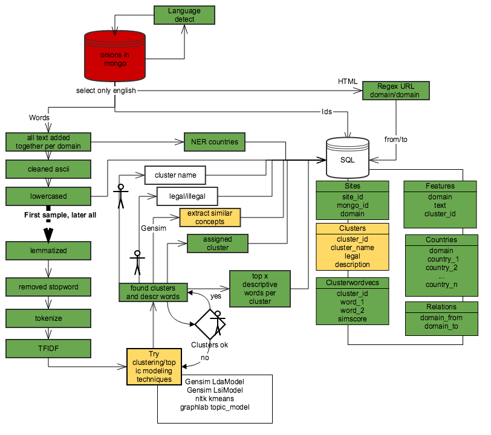
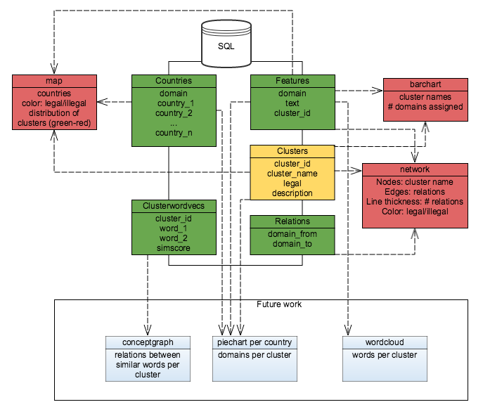

# Shallots

"Shining the light on the deep web, analysis of what is beneath the surface of the internet"
 <a href="http://www.shallots.info/">Analysis dashboard</a>

<i>Summary</i>

The deep web has a lot of secrets. My goal is to give some insight in what is going on there. I'll describe the main topics that are discussed there and give insight in their meaning. I'll divide the clusters into 2 groups (legal/illegal) and find out if they behave like 2 separate islands or are actually connected. And last I'll geographically plot the countries talked about in relation to the clusters. It will start with crawled deep web html content and it will end with a website with visualizations. 

<i>Description</i>

Tor helps anonymous online communication. It is meant to provide safety for vulnerable internet users such as political activists. The downside, however, is that it facilitates criminals that use servers that can only receive connections through Tor, to make it hard to get identified. Those servers are called hidden services and can be accessed through an .onion address. 

Not much research has been done on what is going on in this "deep web". There was some content clustering, which showed that both legal and illegal content is available on websites. It is not clear how connected those 2 groups are. 

<i>Motivation</i>

In 2011 I first encountered the illegal side of the deep web. Since then it kept surprising me that tools and analysts that focus on the internet, normally don't take the deep web into account. They actually should in my opinion because this is especially the place where things can come to the surface since users feel save by the anonymizing function of Tor. 

It is an ideal way to combine my interest in the deep web with my preference for NLP, social network analysis (SNA) and visualization into one project. And it can grow along the way, if there is time, looking further into insights I get during the analysis.

<i>Numbers</i> 
The current setup works wih 3350 crawled onion websites (2408 of which are classified as being in english)
There are 1117 distinct domains within the data, 743 of which being in English. 

<i>Data Sources</i> 
Crawled deep web data stored in mongoDB, crawled by the builder of Ahmia and OnionBot.
<a href=https://github.com/juhanurmi/ahmia/tree/master/onionbot>OnionBot</a>

<i>Details</i>

<i>Process</i>
 -Get the scraped html content stored in MongoDB
 -Check the scraped data for correctness and completeness (+EDA)
 -Detect language of the content and continue only with English content data
 -Find .onion links in result (regex) and fill the relations table with that (id, id) in SQL
 -Clear html from content
 -Clean stopwords, lemmatize and vectorize. Do topic modeling with varying k (somewhere around k=10)
 -Read cluster top x words to decide what the best descriptive word is, if not clear, change k
 -Store manually decided name, legal/illegal in table with cluster
 -NER on country names for visualization
 -Create concept graph data of similar words with word2vec
 -Create json files with relevant data for the viz
 -Create website with data viz dashboard

 -Visualize 
<ul>
<li>Barchart with on click -> wordcloud</li>
<li>Gephi grouped clusters with relations between them based on url references</li>
<li>Map of the world with spectrum red-green based on legal/illegal</li>
<li>.... </li>
</ul>

<i>Architecture & implementation</i>
 -Python
 -MongoDB
 -PostgreSQL
 -d3.js
 -NER from stanford
 -Gensim
 -sklearn NMF

 Chart for data viz

<i>Challenges I ran into:</i>
 -Getting it to work on amazon & storage > a lot of crashes

<i>References</i>
 https://blog.torproject.org/category/tags/crawling 
 http://arxiv.org/pdf/1308.6768v2.pdf
 http://www.dis.uniroma1.it/~dasec/DASec_Pustogarov.pdf
 https://www.gwern.net/docs/sr/2014-spitters.pdf
 https://github.com/juhanurmi/ahmia/tree/master/onionbot

<i>Future work</i>
 -Getting more domains in the crawled data
 -Explore other possible interesting features -> weighting based on html tag
 -Make more visuals + interactive (word2vec viz)
 -Improve topic modeling
 -TSNE

<i>Dependencies</i>
 pip install pymongo
 conda install psycopg2
 pip install psycountry
 pip install fuzzywuzzy
 Geograpy2 -> install from <a href=https://github.com/Corollarium/geograpy2>github</a>, but comment out the reference to geograpy-nltk in the install script. 
 pip install python-Levenshtein
 conda install gensim

<i>Run it</i>
 Be sure to already have crawled data in a mongodb
 Python shallots.py for preparing the data
 Python index.py starting the dashboard
